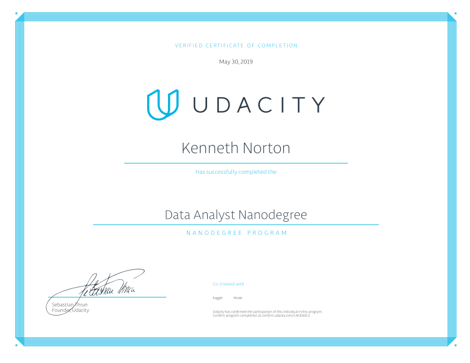

# Data-Analyst-Nanodegree

### Copyright © 2019, Ken Norton

This repository contains projects for Udacity's [Data Analyst Nanodegree](https://www.udacity.com/course/data-analyst-nanodegree--nd002). The nanodegree was completed on May 30, 2019.

---

## [Project 1: Explore Weather Trends](1_Exploring_Weather_Trends/1_Exploring_Weather_Trends.ipynb)

This project will introduce you to the SQL and how to download data from a database. You’ll analyze local
and global temperature data and compare the temperature trends where you live to overall global
temperature trends.

## [Project 2: Investigate a Dataset](2_Investigate_A_Dataset/2_Investigate_A_Dataset.ipynb)

In this project, you’ll choose one of Udacity's curated datasets and investigate it using NumPy and pandas.
You’ll complete the entire data analysis process, starting by posing a question and finishing by sharing your
findings.

## [Project 3: Analyze Experiment Results](3_Analyze_AB_Test_Results/3_Analyze_AB_Test_Results.ipynb)

In this project, you will be provided a dataset reflecting data collected from an experiment. You’ll use
statistical techniques to answer questions about the data and report your conclusions and
recommendations in a report.

## [Project 4: Wrangle and Analyze Data](4_Wrangle_And_Analyze_Data)

Real-world data rarely comes clean. Using Python, you'll gather data from a variety of sources, assess its
quality and tidiness, then clean it. You'll document your wrangling efforts in a Jupyter Notebook, plus
showcase them through analyses and visualizations using Python and SQL.

## [Project 5: Communicate Data Findings](5_Communicate_Data_Findings)

In this project, you will use Python’s data visualization tools to systematically explore a selected dataset for
its properties and relationships between variables. Then, you will create a presentation that communicates
your findings to others.

